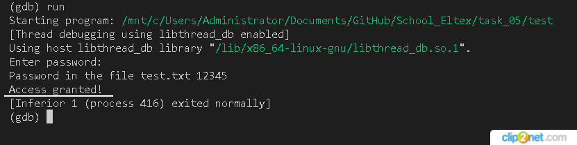

## task_05

### Содержание файла test.txt - 12345
### Работа с отладчиком GDB:
    - скомпилировали файл task_05.c с опцией -g (`gcc -g -o test task_05.c`)
    - проверили, что программа запускается (`./test`)
    - запустили отладчик gdb (`gdb ./test`)
    - посмотрили листинг программы, нужно узнать номер строки проверяющей условие (if (PwStatus == 0) { ... })
    - установили точку остановки на данную строку (break number line)
    - запустили программу в отладчике (`run`), программа остановится на точке остановке
    - ввели команды для установки требуемых нам условий (commands)
    - нам не нужен пока никакой вывод в консоль (`silent`)
    - утановили не нулевое значение в переменную PwStatus (set variable PwStatus = NOT NULL)
    - для продолжения выполнения программы добавили команду (`continue`)
    - закончим ввод команд (`end`)
    - перезапускаем программу (`run`)

*рис. 1 Результат*
