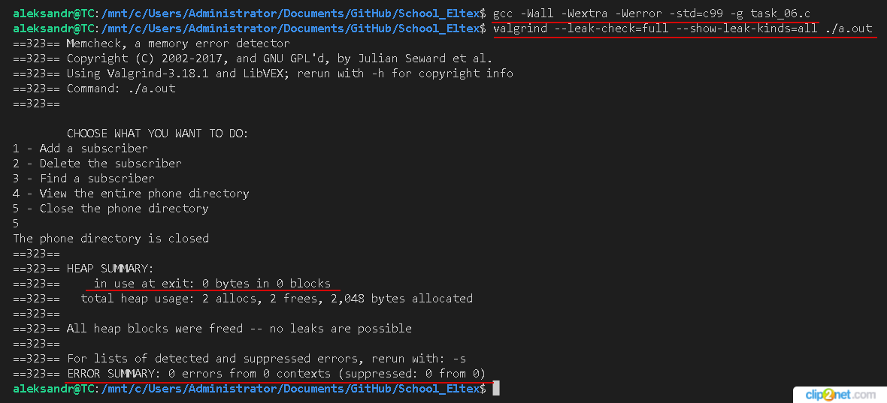
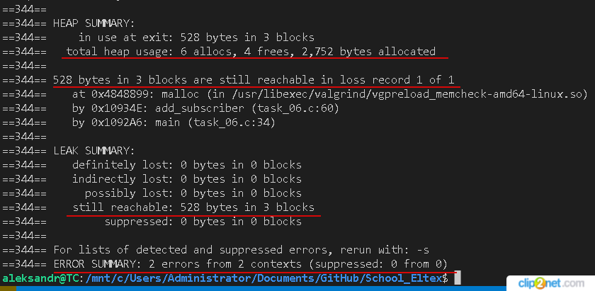
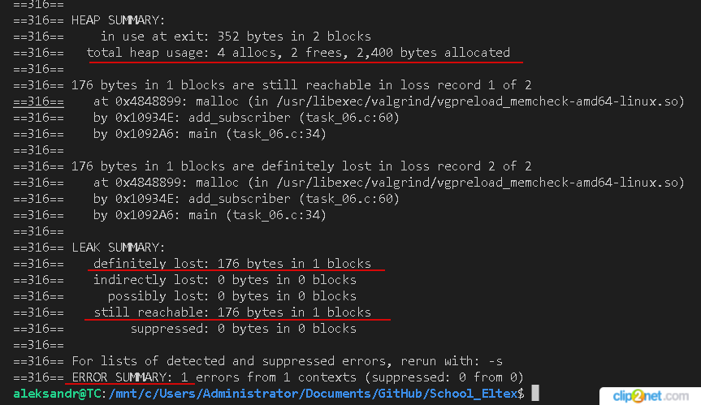

## task_07

### Работа с программной утилитой Valgrind и отладчиком GDB:
    - установил утилиту Valgring (sudo apt install valgrind), проверил версию (valgrind --version)
    - скомпилировал программу для проверки динамической памяти (gcc -g program.c)
    - запустил программу с утилитой Valgrind (valgrind --leak-check=full --show-leak-kinds=all ./program)

*рис. 1 Ошибок при работе с динамической памятью нет*
    - создал ошибку, не освободил память после выделения

*рис. 2 Ошибка, не освободил память после выделения*
    - создал ошибку, дважды освободил память после выделения

*рис. 3 Ошибка, дважды освободил память после выделения*
