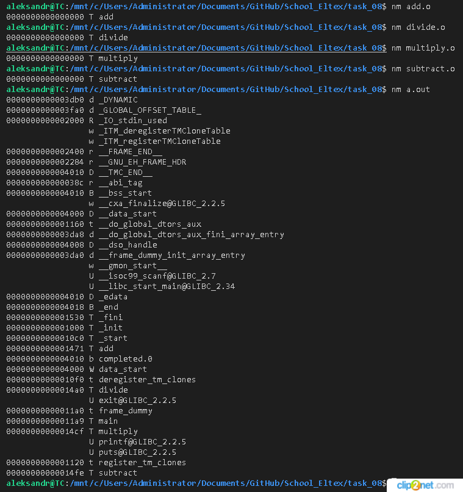
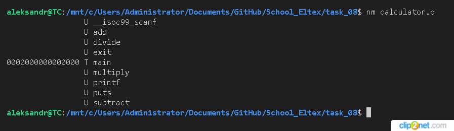
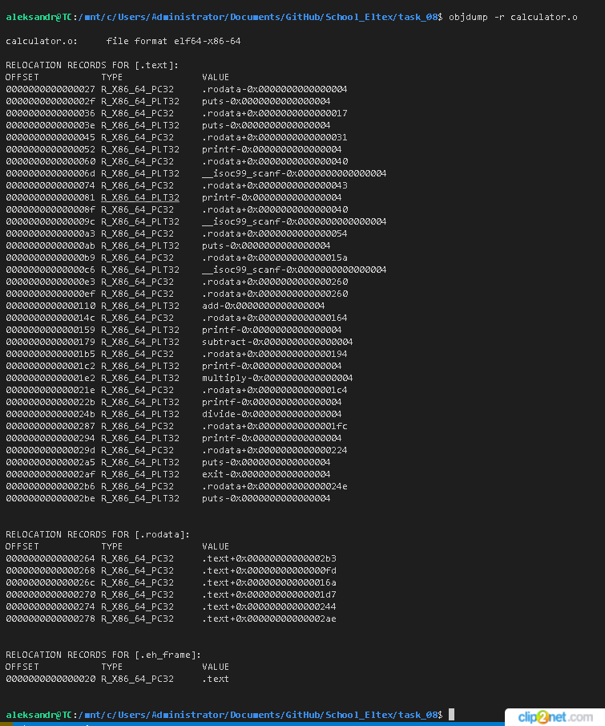
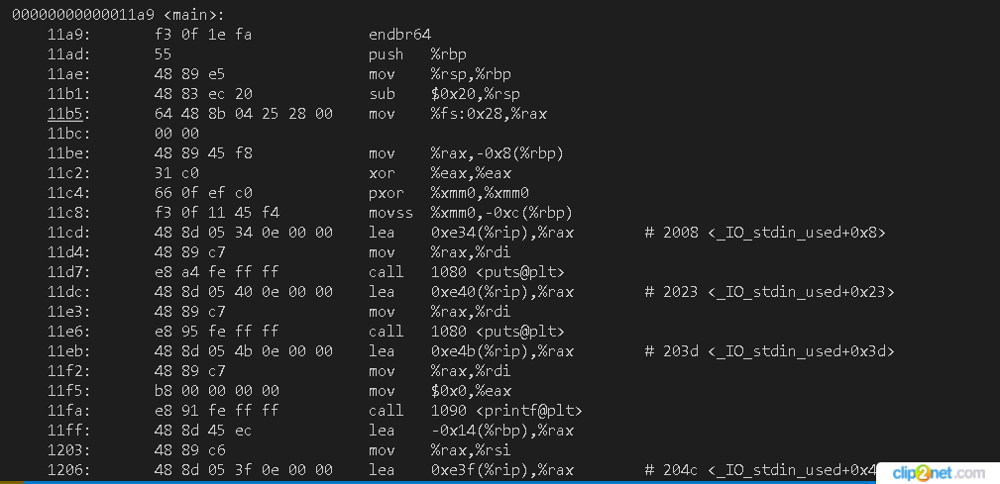

## task_08
### Программа создана в виде основного файла, четырёх файлов по функциям (add, subtract, multiply, divide) и одного заголовочного файла, а также Makefile. В результате компиляции дополнитильно создаются объектные файлы, а также статическая библиотека.

Программа "Простой калькулятор" при запуску (make start) просит ввести два целых числа, далее вводом соответствующий цифры (от 1 до 4) предлагается выбрать одну из четырёх метематических операций (сложение, вычитание, умножение, деление). Выбрав из меню цифру 5 вы завершите работу программу.

### Создание программы простой калькулятор (функции в отдельных файлах):
    - add - функция сложения выводит целое число;
    - subtract - функция вычитания выводит целое число;
    - multiply - функция умножения выводит целое число;
    - divide - функция деления выводит дробное число с двумя знаками после запятой;

### Создание статической библиотеки (статическая линковка означает, что все функции и код, используемые программой, будут включены непосредственно в исполняемый файл программы, что делает его самодостаточным, при запуске программы не будет зависимостей от внешних библиотек, и программа может быть выполнена на любой системе без необходимости установки этих библиотек):
    - компиляция объектных файлов кроме main.c (gcc -c file.c)
    - упаковывание объектных файлов (ar rc libmy_library.a file_1.o file_2.o)
        * ar - утилита для работы с архивами (создание и редактирование), используется для создания статичной библиотеки
        * r - опция позволяет вставлять файлы в архив, если объектный файл есть в архиве, он будет заменён
        * с - опция позволяет создать архив, если он существует, то будет заменён на вновь созданный
        * s - опция указывающая на добавление индексной информации в архив, для быстрого поиска и доступа к содержимому архива
        * lib... - в Linux название библиотеки всегда должно начинаться с lib
        * file_1.o .. - объектные файлы, которые будут включены в архив
        * .a - расширение статичной библиотеки т.к. статичная библиотека в Linux это архив
    - использование статичной библиотеки (gcc -o file file.c -L. -lmy_library)
        * -L. - опция указывает на адрес где находится библиотека, . - означает текущий каталог 
        * -lmy_library - имя библиотеки, при этом префикс lib и суффикс .a усекаются
        * -static - опция определяет, что все необходимые библиотеки, включая стандартную библиотеку C (libc), должны быть связаны с скомпилированной программой статически (gcc main.c -L. -lmy_library -o main -static).

### Работа с объектными файлами
    - nm (name) - утилита позволяет просматривать символьные таблицы объектных файлов или исполняемых файлов на Unix-подобных системах. Выводит символы (функции, переменные и т.д.) и их соответствующие адреса, которые доступны в этом файле, используется для отладки или анализа объектного файла:
        * T - символ кода;
        * D - символ данных;
        * U - неопределенный символ (требуется для связывания с другими объектными файлами или библиотеками);
        * может вывести дополнительную информацию о символах: их размер или смещение.

*Рис. 1 Вывод утилиты nm объектных файлов (*.o) и исполняемого (a.out)*
При просмотре объектных файлов видим таблицу относящиюся к модулю text (Секция кода или секция текста содержащая исполняемые инструкции для процессора), определена соответствующая функции add и др. и адреса этих функций.
При просмотре бинарного (исполняемого) файла, у всех инструкций уже есть виртуальные адреса, смещения (в 16-ном формате)

*Рис. 2 Вывод утилиты nm объектного файла calculator.o*
При просмотре объектного файла видим таблицу относящиюся к модулю text (Секция кода или секция текста содержащая исполняемые инструкции для процессора), определена соответствующая функции main и адрес этой функции, а также неопределённый символы для наших и библиотечных функций

    - objdump - утилита для дизассемблировании обычных двоичных файлов, которые не расширяются, не удаляются, не используют обфускацию. Он может читать все распространенные типы двоичных ELF файлов.
        * -r - просмотр таблицы релокации;
        * -D - просмотр всех данных / код в каждом разделе файла ELF;
        * -d - просмотр только программного кода в файле ELF;
        * -tT - просмотр всех символов
    - readelf - утилита анализирует каждый бит данных, используемый в формате ELF и позволяет получить большое количество информации об объекте ещё до его реверс инжиниринга.

*Рис. 3 Таблица релокации объектного файла calculator.o*

*Рис. 4 Вывод инструкций ассемблера, адреса инструкций, код машинных инструкций и ассемблерный код бинарного (исполняемого) файла a.out*
