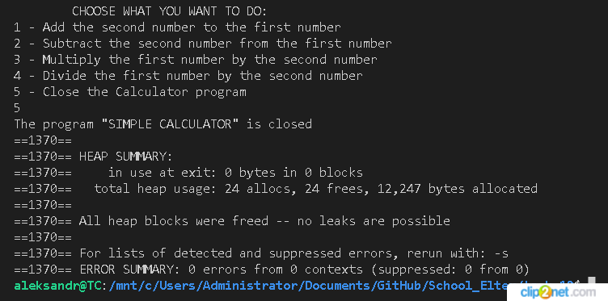

## task_10
### Программа создана в виде основного файла, четырёх файлов по функциям (add, subtract, multiply, divide) и одного заголовочного файла, а также Makefile. В результате компиляции дополнитильно создаются объектные файлы, а также четыре (по функциям) динамических библиотеки.

Программа "Простой калькулятор" при запуску (make start) просит ввести необходимое количество библиотек целое число (от 1 до 4). Далее предлагается ввести названия библиотек, в программе есть 4 библиотеки, их названия, а ткже пример ввода появляеются в консоли. До тех пор, пока не будут введены названия имеющихся библиотек (по их колличеству) программа будет запрашивать ввод, можно повторять ввод названий библиотек, в таком случает пользователь будет работать с одной библиотекой.
Далее программа просит ввести два целых числа, далее вводом соответствующий цифры (от 1 до 4) предлагается выбрать ту операцию чья библиотека загружена (сложение, вычитание, умножение, деление). Выбрав из меню цифру 5  вы завершите работу программу.
, пример для ввода имеющиесявводом соответствующий цифры (от 1 до 4) предлагается выбрать одну из четырёх метематических операций (сложение, вычитание, умножение, деление). Выбрав из меню цифру 5  вы завершите работу программу.

dlfcn.h — стандартная библиотека включает функции и макросы, для динамической загрузки и использовая кода из динамических библиотек во время выполнения программы. Функции (или макросы) которые обязательно должны быть в коде:

    - void* dlopen(const char* filename, int flags); - Функция открывает динамическую библиотеку и возвращает указатель на её дескриптор.
    - void *dlsym(void *handle, const char *symbol); - Функция находит указанное имя символа в динамической библиотеке и возвращает его адрес.
    - int dlclose(void *handle); - Функция закрывает динамическую библиотеку.
    - char *dlerror(void); - Функция возвращает строку, содержащую последнее сообщение об ошибке.
Перед использованием функций библиотеки dlfcn.h, требуется компиляция и линковка с опцией -ldl (gcc -o main main.c -ldl).

### Определяем какую библиотеку загрузили в программу и какую функцию она содержит
    - void* library; - cоздали переменную типа void* для хранения дескриптора библиотеки:
    - library = dlopen("./name_library.so", RTLD_LAZY); - загружаем библиотеку с сохранением её дескриптора в указателе library;
        *  RTLD_LAZY - Загружает библиотеку в память, но не разрешает ее символы до их фактического использования. Символы (функции и переменные) в библиотеке будут связываться только при первом вызове, а не при загрузке библиотеки. Это позволяет избежать загрузки кода, который не будет выполнен в результате условных операторов или неиспользуемых функций.
        * RTLD_NOW - Загружает библиотеку в память и немедленно разрешает все ее символы. Это означает, что все зависимости и символы библиотеки разрешаются на этапе загрузки.
        * RTLD_GLOBAL - Символы из загружаемой библиотеки будут доступны для разрешения и другим библиотекам при последующих вызовах dlopen(). Этот флаг позволяет использовать символы из загружаемой библиотеки в других библиотеках.
        * RTLD_LOCAL - Символы из загружаемой библиотеки будут доступны только для разрешения внутри этой библиотеки. Этот флаг ограничивает область видимости символов только на текущую библиотеку.
        * RTLD_NODELETE - Запрещает выгрузку библиотеки при вызове dlclose(). Если этот флаг установлен, библиотека будет оставаться загруженной в памяти даже после вызова dlclose(). Этот флаг может быть полезен, если требуется использование символов из библиотеки после освобождения её выделенных ресурсов.
        * dlopen("libmy_library.so", RTLD_LAZY | RTLD_GLOBAL) - флаги могут быть объединены с помощью побитовых операторов 
    - void (*function)(void); - получаем адрес функции в библиотеке, передав в неё дескриптор библиотеки и имя функции;
    - function = (void (*)(void)) dlsym(library, "name_function");
    - void (*add)(float, float) = dlsym(add_lib, "add"); - add_lib - дескриптор динамической библиотеки, который был сохранен в переменной add_lib после вызова dlopen, "add" - имя символа, который ищем в библиотеке. Результат функции dlsym сохраняем в указателе add на функцию с сигнатурой float (*)(float, float), принимает два аргумента типа float и возвращает значение типа float.
    - function() - 
    - add(valu _1, value_2) - вызываем функцию;
    - dlclose(library); - закрываем библиотеку.
    - if (library != NULL) dlclose(library); - закрываем библиотеку предварительно проверив, что она открыта, если не открыта будет ошибка.
    - запустил программу с утилитой Valgrind (valgrind --leak-check=full --show-leak-kinds=all ./program);

*рис. 1 Ошибок при работе с динамической памятью нет*
